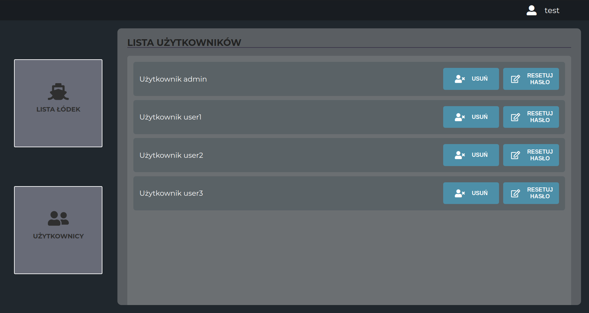

# BoatApp
The application is used to manage drone-boats

## General Information
The application is used to manage drone-boats. 
It allows you to select boats from the list and move to a specific area and return to the bases. There is also an admin profile to manage the boats and the user list.

## Technologies Used
- React 
- React Router
- react-google-maps/api
- Babel
- GRID
- CSS3
- SASS
- REST API
- Webpack

## Screenshots

## Setup
- npm install --dev
- npm start

## Contact
emilia.parzych92@gmail.com
